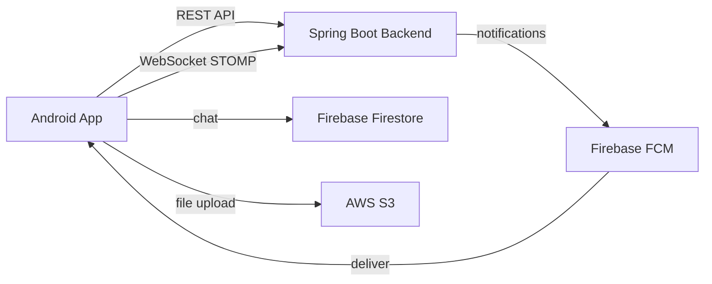
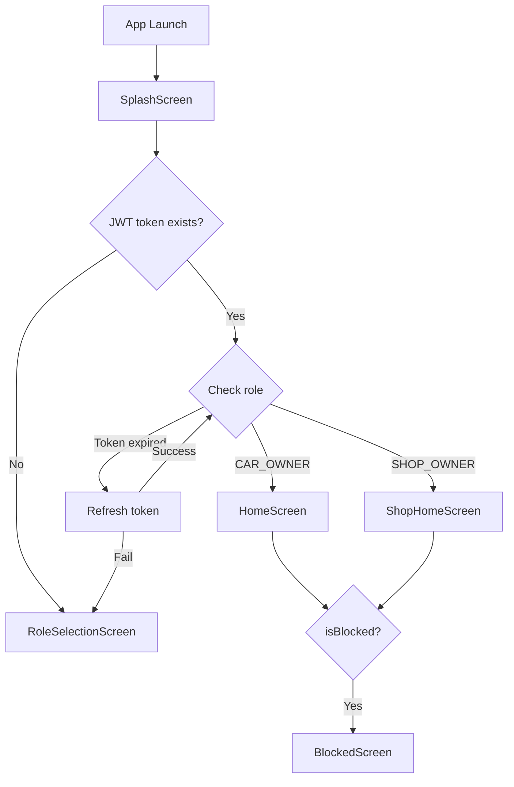
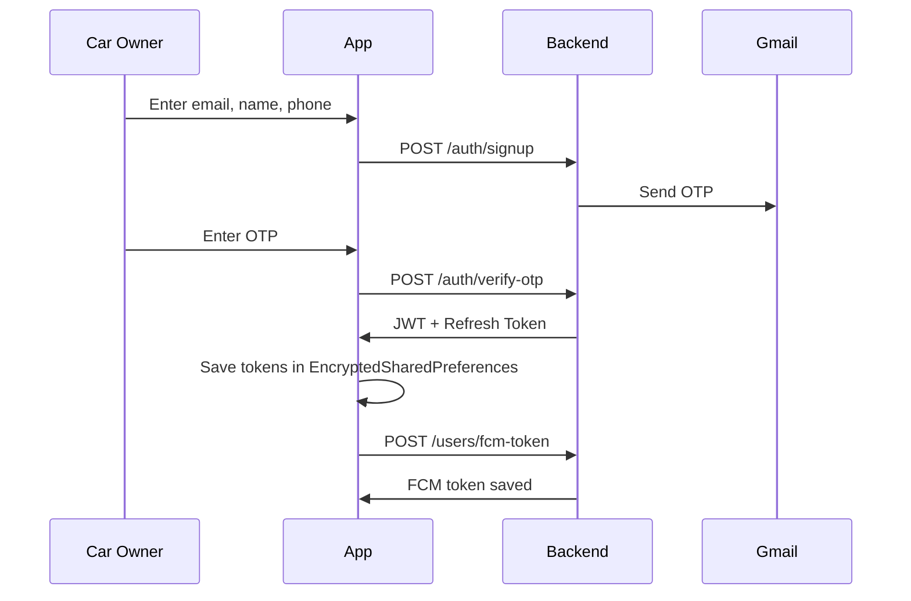
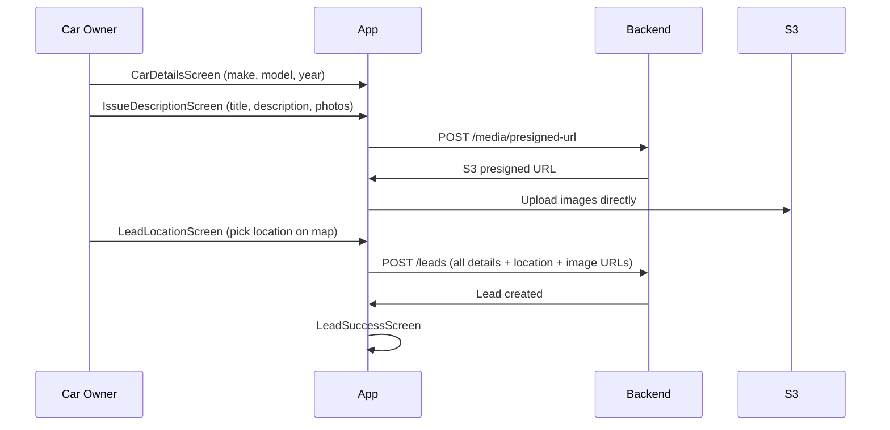
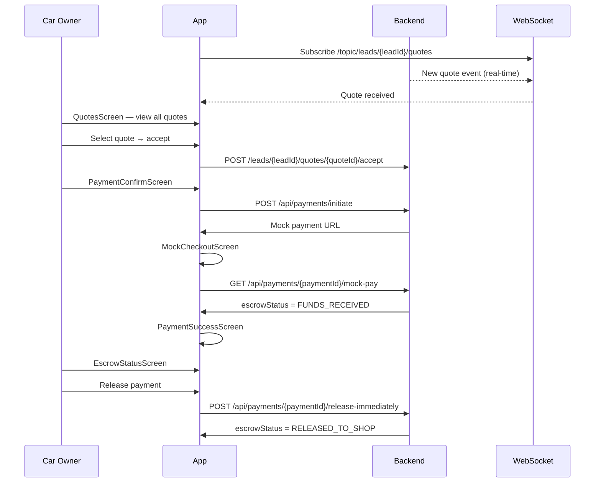
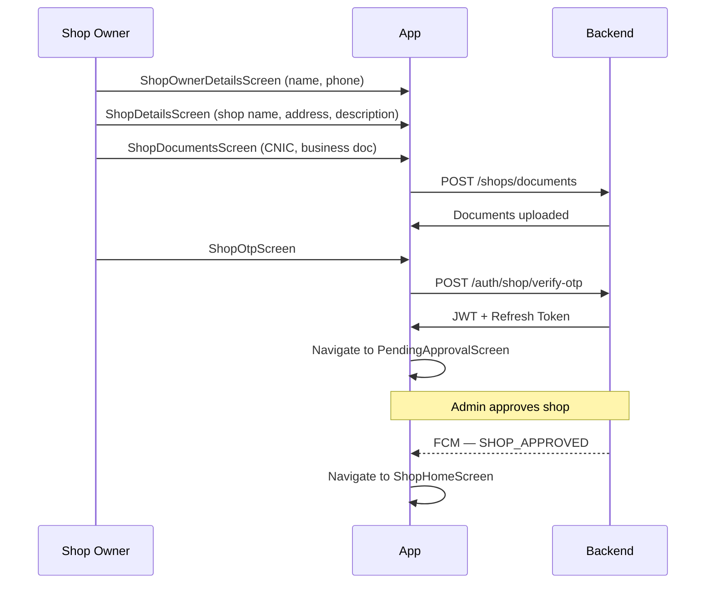
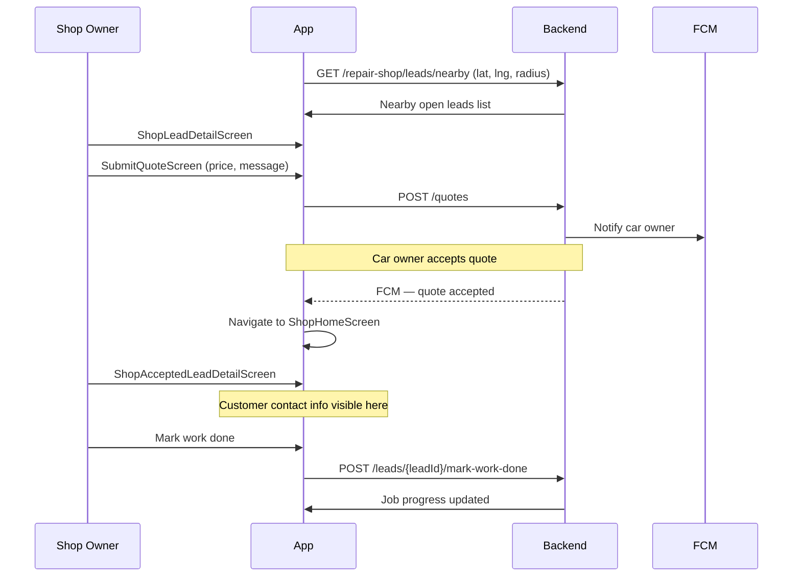
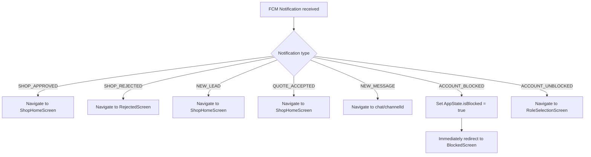
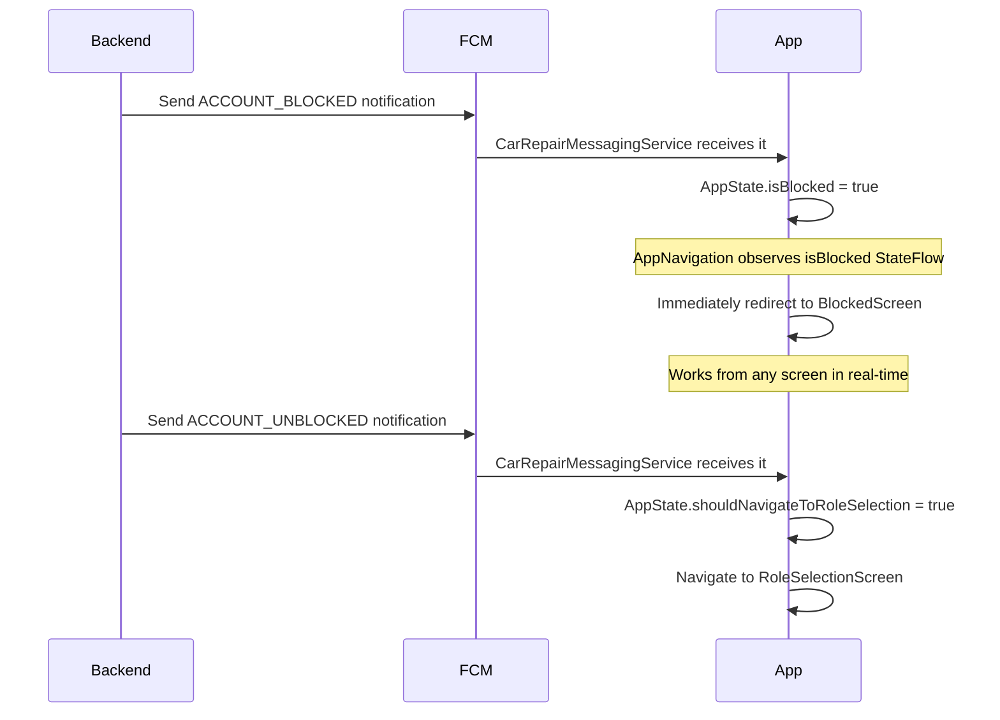
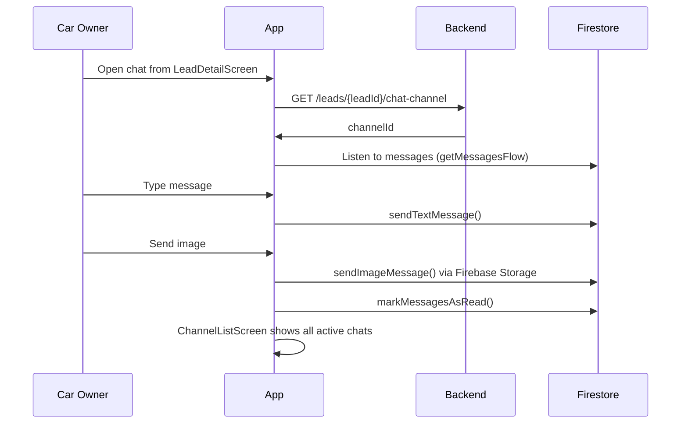

---

# Repairo — Android App

Repairo Android app is built for two roles — Car Owner and Shop Owner. Car owners post repair leads, track quotes, chat with shops, and make payments. Shop owners browse nearby leads, submit quotes, and manage their jobs.

---

## Tech Stack

- Kotlin, Jetpack Compose
- Retrofit + OkHttp (REST API)
- Firebase FCM (push notifications)
- Firebase Firestore (real-time chat)
- Firebase Storage (chat images)
- STOMP over SockJS (real-time quotes via WebSocket)
- EncryptedSharedPreferences (secure local storage)
- Coil (image loading)

---

## Roles

- CAR_OWNER — posts leads, views quotes, makes payments, chats with shops
- SHOP_OWNER — views nearby leads, submits quotes, manages job progress, buys credits

---

## System Architecture


---

## App Startup Flow



---

## Car Owner Auth Flow



---

## Lead Posting Flow



---

## Quote and Payment Flow



---

## Shop Owner Auth Flow



---

## Shop Lead and Quote Flow



---

## FCM Notification Handling



---

## Block/Unblock Flow



---

## Chat Flow



---

## Prerequisites

- Android Studio Hedgehog or newer
- Java 17
- `google-services.json` from Firebase project
- Running Repairo Spring Boot backend

---

## Environment Setup

In `RetrofitClient.kt` base URL set karo:

```kotlin
// Emulator ke liye
private const val BASE_URL = "http://10.0.2.2:8080/"

// Physical device ke liye apna machine ka local IP use karo
private const val BASE_URL = "http://192.168.x.x:8080/"
```

---

## Key Decisions

- Firebase Firestore used for chat instead of third-party SDK (Stream Chat had integration issues)
- FCM token saved after login, also cached in EncryptedSharedPreferences if user was not logged in at token refresh time
- BlockCheckInterceptor handles 403 ACCOUNT_BLOCKED globally across all API calls
- AppState uses MutableStateFlow so block/unblock works from any screen instantly
- Chat navigation handled via LaunchedEffect and resetChannelId() to avoid re-triggering
- Bottom navigation hidden on detail, chat, and payment screens
- S3 upload done directly from app using presigned URLs — backend never handles file bytes
- STOMP WebSocket used only for real-time quote delivery on lead detail screen

---
